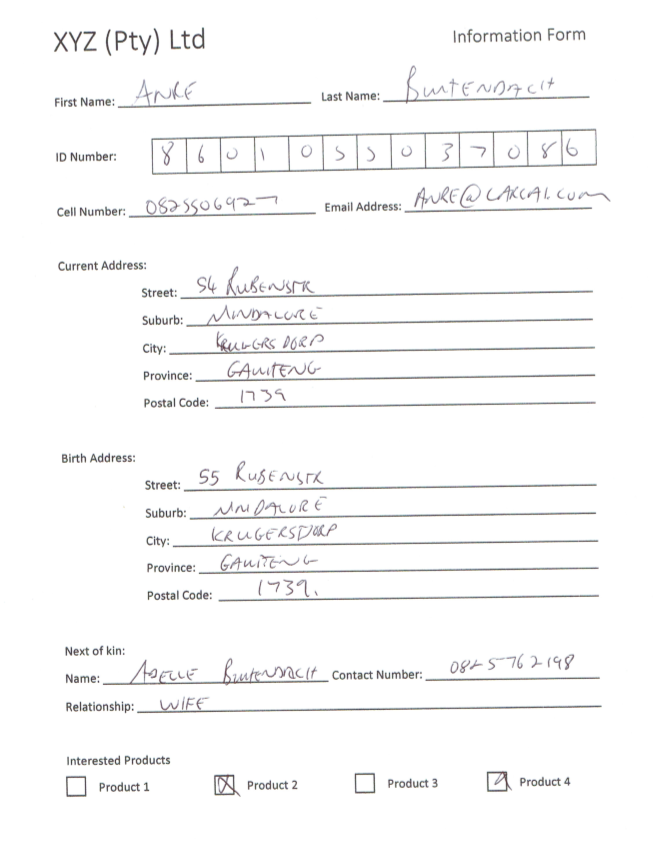
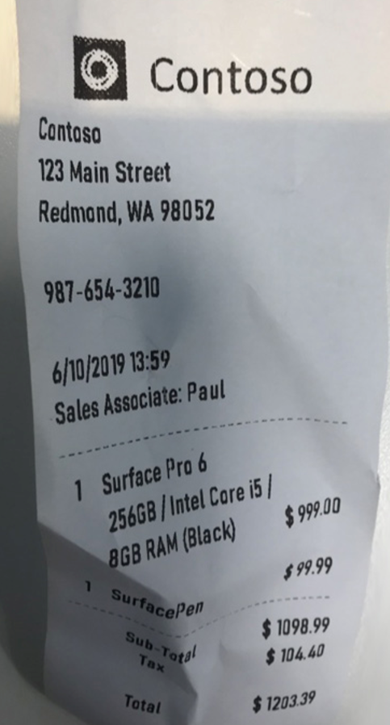

# Understanding the Documents page

## Types of documents

you can identify 3 main categories: structured, semi-structured and unstructured. Each type of document comes with its own set of challenges.

### Structured documents

Structured documents generally focus on collecting information in a precise format, guiding the person who is filling them with precise areas where each piece of data needs to be entered.

### Semi-structured

Semi-structured documents are documents that do not follow a strict format the way structured forms do and are not bound to specified data fields. These don't have a fixed form but follow a common format.

## un-structured

Unstructured documents are documents in which the information isn't organized according to a clear, structured model.

## Available Fields

| Field Name   | Description                                             |
| ------------ | ------------------------------------------------------- |
| Id           | Displays the generated Id of the Document               |
| Master       |                                                         |
| Date Created | Displays the date the Document was uploaded to AiForged |
| Filename     | Displays the Filename of the Document                   |
| Type         | Displays the file type of the document                  |
| Usage        | Displays the current Usage of the Document              |
| Status       | Displays the Status of the document                     |
| Actions      | Displays Actions that is available to this document     |
| Comment      | Displays Comments left on this document                 |
| Result       | Displays the Result of this document                    |
| Category     | Displays the Category                                   |

## Document Actions

.png>)

* Opens documents linked to this document

.png>)

* Opens documents on your operating system

.png>)

* Downloads the Document to your system

.png>)

* Opens the document hierarchy

.png>)

* Pens the documents structured results

.png>)

* Shows the documents results

.png>)

* Opens the document for verification

## Sort the Documents grid

.png>)

* You can Sort the documents page by clicking on any of the table headers
* All Sorting of the documents happens **server side**
* To do multiple column sorting use **CTRL + Left Mouse Click** on the columns

## Bulk Category Updates

The Bulk Category Update Action allows you to update all the selected Document categories

.png>)

1. To do a Bulk category Update click on “Bulk Category Update” in the app bar.
2. A popup will appear asking what Document Status you would like to update.
3. Once you have selected the Status another popup will appear.
4. Select the Usage of the documents you would like to update, after selecting the Usage another popup will appear asking you to select the Categories you would like to update.
5. Select the Category you would like to update it to and click yes on the Next popup.
6. Your category update should be completed.

## Bulk Status Updates

The Bulk Status Update Action allows you to update all the selected Document statuses

.png>)

1. To do a Bulk Status Update click on “Bulk Status Update” in the app bar.
2. A popup will appear asking what Document Status you would like to update.
3. Once you have selected the Status another popup will appear.
4. Select the Status you want to Update it to, after selecting a value another popup will appear.
5. Select the Document Usage you would like to update, the next prompt will ask to what Usage you would like to update to.
6. After selecting yes your Statuses should be updated.

## Bulk Copy

The Bulk Copy Action allows you to **copy** the documents to another project and service.

.png>)

1. To do a Bulk Copy click on “Bulk Copy” in the app bar.
2. A popup will appear asking to select a destination project.
3. Once you have selected the Destination project, another popup will appear asking to select the Destination service.
4. Select the Status you want to Copy, after selecting a value another popup will appear.
5. Select the Target Status you want the copied documents to be, after selecting a value another popup will appear.
6. Select the Document Usage you want to copy, the next prompt will ask to what Usage you would like the copied documents to be.
7. After completing all the prompts and yes has been clicked your documents should **copy**.

## Bulk Move

The Bulk Move Action allows you to **move** the documents to another project and service.

.png>)

1. To do a Bulk Move click on “Bulk Move” in the app bar.
2. A popup will appear asking to select a destination project.
3. Once you have selected the Destination project, another popup will appear asking to select the Destination service.
4. Select the Status you want to Copy, after selecting a value another popup will appear.
5. Select the Target Status you want the copied documents to be, after selecting a value another popup will appear.
6. Select the Document Usage you want to copy, the next prompt will ask to what Usage you would like the copied documents to be.
7. After completing all the prompts and yes has been clicked your documents should **move**.

## Process Checked

The Process Checked Action allows you to **process** selected documents.

.png>)

1. To **Process** a checked document, check all the document you would like to process.
2. Click on the Process Checked click on the Process “Process Checked” Action in the app bar.
3. A popup will appear to check if you want to process the documents, click yes.
4. A Log Events popup will appear displaying the progress of **processing** the documents.

.png>)

## Copy Checked

The Process Checked Action allows you to **process** selected documents.

.png>)

1. To **Copy** a checked document, check all the document you would like to copy.
2. Click on the Copy Checked click on the Process “Copy Checked” Action in the app bar.
3. A popup will appear asking to select a destination project.
4. Once you have selected the Destination project, another popup will appear asking to select the Destination service.
5. Select the Status you want to Copy, after selecting a value another popup will appear.
6. Select the Target Status you want the copied documents to be, after selecting a value another popup will appear.
7. Select the Document Usage you want to copy, the next prompt will ask to what Usage you would like the copied documents to be.
8. After completing all the prompts and yes has been clicked your documents should **move**.

## Delete Checked

The Delete Checked Action allows you to **delete** selected documents.

.png>)

1. To **Delete** a checked document, check all the document you would like to delete.
2. Click the “Delete Checked” Action in the app bar.
3. On the prompt click “Yes” to approve the deletion of the documents

## Set Checked Status

The Checked Status Action allows you to change the selected documents statuses selected documents.

.png>)

1. To **Set the Status** of a checked document check all the document you would like to change the Status of.
2. Click the “Set Checked Status” Action in the app bar.
3. On the First prompt select the new **Status**
4. On the next prompt click “Yes” to approve the Status change of the checked documents

## Update Checked

The Update Checked Action allows update a checked document.

.png>)

1. To **Update** a checked documents check all the document you would like to Update
2. Click the “Update Checked” Action in the app ba

## Upload

The Upload Action allows you to upload a new document.

.png>)

1. Click the “Upload” Action in the app bar.
2. In the popup Select the Status of the Document being uploaded
3. After selecting the Status select the document category to be uploaded
4. Select the document on your local machine to be uploaded and click “Open”
