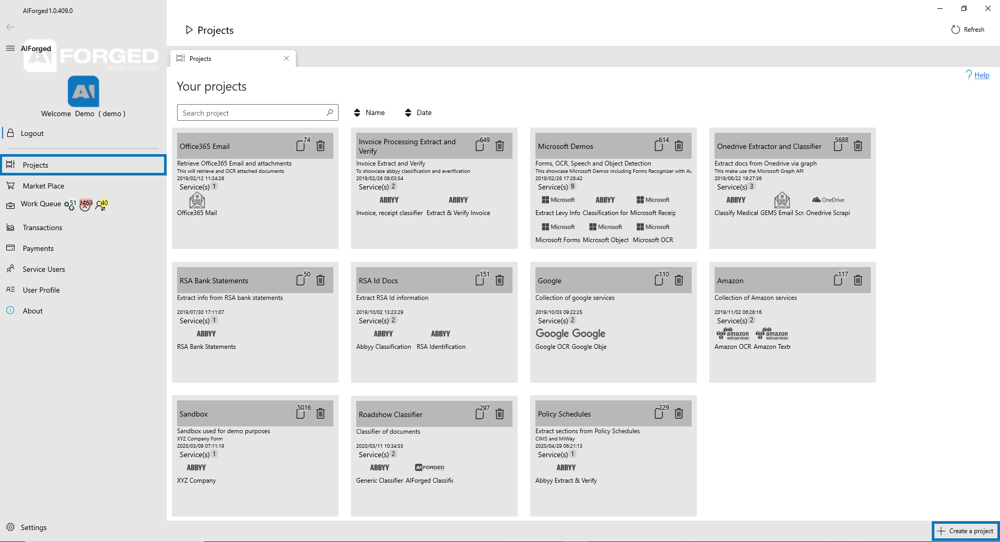
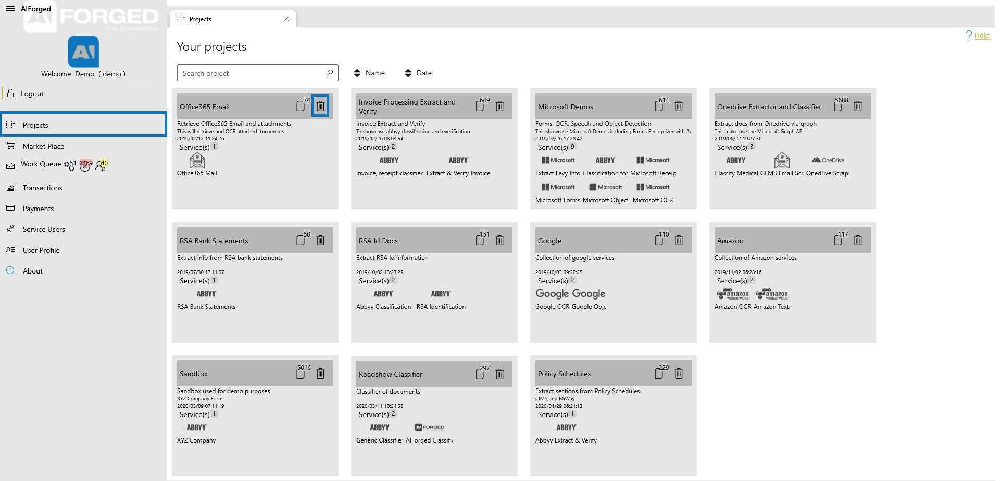

# Projects

The projects page displays all your created projects and allows you to create a new project at any time. The Projects also displays internal services and you can access them by clicking or tapping on the service.

### How to create a project

* Click on “create a project” on the bottom right of the screen.

* Fill in the new Projects name make sure that they are unique since it could later affect your reports.
* Click on “Create project” to Create a new Project.
* Click on yes when the popup appears
* You will be navigated back to the Projects page where you can view that Project.

### How to delete a project

* Click on the junk Icon on the project to delete the project
* After the delete button is clicked a prompt will ask you to accept
* After accepting your project will be deleted

## Services

### Understanding Services

#### Service Actions

* Opens the Definition Box for the service

* Opens the Training Box for the service

* Opens the Services Inbox

* Opens the Services Outbox

* Allows you Continue your Training or Force Retraining of the Service

* Opens the Service Wizard

* Allows you to delete the Service

* Allows you to Add a Service to this Service

* Allows you to Add a Utility to this Service

* Allows you to Add a Verification Service to this Service

* Allows you to Initialise the Service execution

* Allows you to Save the Service

* Opens the Document Categories for the Project in which the Service is Contains

* Open the Services keys page

* Opens All the Definitions for the Service

* Opens the Analytics page of the Service

* Opens all the Events for the Service

* Opens all the Audits for the Service

* Opens the Share on Marketplace page

